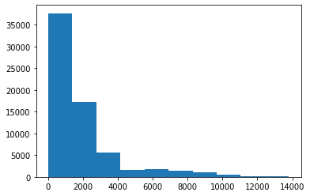

## User Guild

For the whole dataset, use [edge.csv](edge.csv) and [vertex.csv](vertex.csv). **For a smaller dataset**, run `generate data with specific size.exe` script to generate dataset with the size you want, the output will be `edge_sm.csv` and `vertex_sm.csv`

## Data

*Vertex:*

| ITAT | latitude          | longitude         | altitude |
| ---- | ----------------- | ----------------- | -------- |
| PEN  | 5.297140121459961 | 100.2770004272461 | 11       |

*Edge:*

| ITAT (start) | ITAT (dest) | Weight            |
| ------------ | ----------- | ----------------- |
| AER          | KZN         | 0.667554408910309 |

## Statistic

airline number

route distance

## Weight formula

`W`: weight

`A`: airline number

`D`: route distance
$$
\begin{cases} W = \frac12 (\frac{1}{A}) + \frac12(0.95 + (\frac{D}{4500\cdot D_{max}}\cdot 0.05) &  D > 0.95  \\ W = \frac12 (\frac{1}{A}) + \frac12(\frac{D}{4500}) , & D \leq 0.95 \end{cases}
$$
